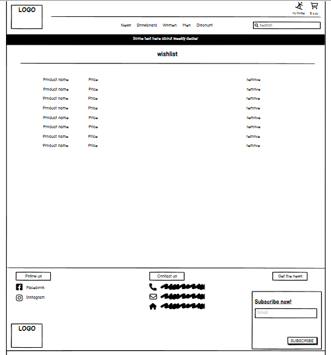
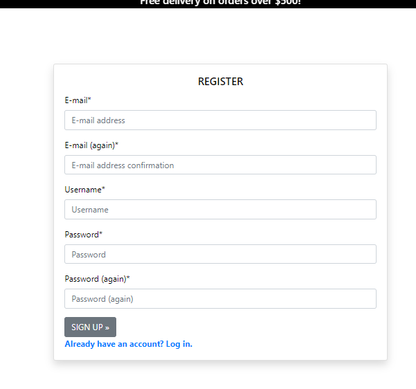
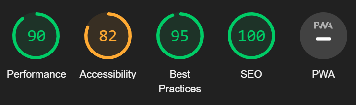

# Snowpatrol

Snowpatrol is a fictional B2C e-commerce store that is designed and implemented with Python and Django, HTML, CSS and some Javascript. 
However it has to be noted that this site is for educational use only.

Please view the live website here: [Snowpatrol](https://snowpatrol-6b2d334410bf.herokuapp.com/ "Snowpatrole Homepage").
 
My Repository can you see here: [Repository](https://github.com/Karroroenning/Snow-Patrol "Repository").

## Table of contents
+ [UX](#ux)
  + [Site Purpose](#site-purpose)
  + [Site Goal](#site-goal)
  * [Future Goals](#future-goals)
* [User Stories](#user-stories)
  * [Site User](#as-a-site-user)
  * [Admin](#as-a-admin)
* [Design](#design)
  * [Wireframes](#wireframes)
  * [Color Scheme](#color-scheme)
  * [Typeography](#typography)
  * [Imagery](#imagery)
* [Features](#features)
  * [Homepage](#homepage)
  * [Add Recipes](#add-recipes)
  * [Recipes Home](#recipes-home)
  * [Recipes Detail](#recipes-detail)
  * [Edit ecipes](#edit-recipes)
  * [Delete ecipes](#delete-recipes)
  * [Contact](#contact-page)
  * [Sign-In](#sign-in)
  * [Sign-Out](#sign-out)
  * [Sign-Up](#sign-up)
* [C.R.U.D.](#crud)
  * [Create](#create)
  * [Read](#read)
  * [Update](#update)
  * [Delete](#delete)
* [Manual Testing](#manual-testing)
* [Admin Panel](#admin-panel)
* [Validator Testing](#validator-testing)
* [Defensive Validation](#defensive-validation)
* [Accessibility](#accessibility)
* [Fixed bugs](#fixed-bugs)
* [Technologies Used](#technologies-used)
* [Deployment](#deployment)
* [Credits](#credits)

## UX
### Site Purpose
The purpose of the website is to be able to give users an opportunity to explore what is available to use within the world of snowboarding. Whether you are a beginner or a professional, there is always an option that suits them. Even when you have bought what you need, there is always a reason to visit the website again, because there is a blog that the admin updates a few times a week to update users about all the upcoming news, various tips on good slopes and even tips on how to think about how to wax the board for next season.

### Site Goal
- An easy to navigate website with clear purpose.
- Provide users with products that meet their expectations.
- To provide tools that allow users to search for products.
- Allow users to view and read about the products that may help or interest them.
- Allow users to give their review on any product.
- Allow users to add products to a wishlist of theirs.
- To give users news or tips about what's happening in snowboarding.
- Allow users to checkout quickly and easily.
- To allow users to create a profile to view past orders and update profile information.

### Future Goals

## User Stories

### As a site user: 

- Navigate around the site in a smooth and simple way. (must do)
- See a list of products and can choose the product you want. (must do)
- Search products to find a specific product. (must do)
- Click on a product to read and view the details. (must do)
- Register for an account to avail of the services offered to members. (must do)
- View product reviews so that I can read other users opinions. (Could do)
- Buy a product by using the website checkout system. (must do)
- I can sort products on criteria such as price and category so that I can have a method of ordering the products as I prefer. (Could do)
- I can view the contents of my shopping basket so that I can be able to make any adjustments. (must do)
- Sign up to newsletter so that I can keep updated on the latest news. (must do)
- User Signup Email Confirmation. (must do)
- Cart is displayed on the top right navigation panel, so that users can avoid spending too much. (must do)
- Read about the latest news. (Could do)

### As a login user:

- Delete my previous review. (Could do)
- Leave a review about a product. (Could do)
- Edit my previous reviews. (Could do)
- Save my data under my personal profile. (must do)
- I can view my order history. (must do)
- Manage my profile by updating my details. (must do)
- Logout of the website. (must do)
- Add products to my wish list (Could do)

### As a Admin:

- Create and publish a new product. (must do)
- Create a draft of a new product so it can be finalised later. (Could do)
- Create a new user, products, and categories. (must do)
- Delete user, products, categories and reviews. (must do)
- Approve user's reviews. (Could do)
- Create and publish a new blogpost from adminpanel. (Could do)

## Agile Methodology

The development of this project was managed and implemented using GitHub Projects Kanban Board. Available here:
<a href="https://github.com/users/Karroroenning/projects/7" target="_blank" rel="noopener" aria-label="Link to GitHub Projects">Snowpatrol - User Stories</a>

 

## Design
### Wireframes

- A low-fi wireframe was build before developing the website.
- This was done in Balsamiq Wireframes. 

Home Page

Product Page

Product Detail

Blog list

Blogpost

Checkout

Checkout success

Product Management

Profile

Shopping bag

Wishlist

Signup

Login

Logout

### Color Scheme

Color Scheme

I have kept the colors very simple. Black and white. Because there are already a lot of other colors from all the product images and blog post images. The fact that the basic colors are black and white means that the focus is more on the products. This is an e-commerce website and our goal is for the focus to fall on our goal, the products!

### Imagery:

- On the first page, I have a picture that I think is a good picture for a first impression that snowboarding is more than just going down a slope. It can also be sporty and peaceful in a beautiful nature.

Hero Image

 

- Up in the left corner, we have our own designed logo. The logo should resemble a mountain and a bar-code. The mountain should symbolize slope and the bar-code is that it is an e-commerce website.

Logo

 
- All other images are of the products and blog post images that the admin can add from the admin panel.

## Features

### Navbar and Footer
- A navbar with nav-items to navigate to various pages in the website.
- The logo at the top left which also takes us to the first page.
- The search box where you can search for a product you are looking for.
- My account button that takes one to their profile page, wishlist and log out.
- On the right we have our shopping cart so you can clearly see how much you spend.
- Footer with social media, adress, contact and subscribe.

Navbar

Footer

### Homepage
- We have the hero image with a short text about our blog and a button that will take us to the blogposts.

Hero Image

### Bloglist
- Blogposts lined up. 3 posts per row. 9 posts per side.
- Below the blog post images we have a title for the blog post and the date it was created.
- You can click on either the image or the title to get to the blog post page.

Bloglist

### Blogpost
- Under the navbar, we have the title of the blogpost and when it was created. 
- Picture of the blogpost is to the right of the text.
- To the left of the picture we have the content about the blog post.

Blogpost

### Product page
- Under the product heading we have links for the product categories. 
- On the right we have a dropdown menu to be able to sort the products.
- Products lined up. 4 posts per row.
- Below the image we have the name of the product, the price, the category and what rating it has. If Admin is logged in, there are also two links with Edit and Delete. 
- You can click on the image to get to the Product detail page.
- Down in the right corner we have a button that takes us back to the top of the page.

Product page

### Product detail
- On the right we have the product image. When you press it, the image opens in a separate tab.
- On the left we have the product's name, price, category and rating. If Admin is logged in, there are also two links with Edit and Delete. 
- Underneath we have the product description, a dropdown menu so you can choose the size of the product, choose the quantity of how many you want. Then we have three buttons, one that takes us back to the product page and one to add the product to the bag. If you are logged in, you also have a button so you can add the product to your wishlist.
- At the bottom of the page we have a review section. Logged in users can leave a review about the product, update and delete their own review. If you are not logged in, you can only read reviews.

Product detail

Reviews

### Wishlist
- The wishlist is only availabe for logged in users. A logged in user can add or delete a product to this list.
- You can click on the product name to get to the product detail page.

Wishlist

### Shopping Bag
- Products that you have added to your shopping bag end up here. 
- The picture of the product is on the left together with the product name and which size you have chosen. 
- On the right, we have how much the price is for a product, followed by how many products have been selected and the total amount for the product. 
- You can update the quantity of products or remove your product from your shopping bag by changing the number and pressing update or if you want to remove the product press the remove button.
- At the bottom of the page we have the total amount, shipping cost and grand total.
- We have two buttons below, one that takes us back to the product page and the other goes to our checkout page.

Shopping bag

Shopping bag grand total

### Checkout
- On the left side you enter your personal information including delivery information. If you are a logged in user, you can check a check box that you want to save your info to your profile page.
- On the right side we have our order summary and the total grand total.
- At the bottom of the page under delivery info, you enter your card details and if they are correct you can press the complete order button. If you want to change your shopping bag, press the adjust bag button to return to the checkout page.

Checkout

### Checkout success
- On this page we have our order information.
- We also have a button that takes us to the blog page.
- After paying, the user also receives a confirmation email.

Checkout success

Confirmation Email

### My profile
- You have your own profile page if you are logged in.
- On the left side we have the user's delivery information which can be updated by pressing the button update information.
- On the right side we have the user's order history. The order number, date the order was placed, items and order total are displayed there.
- If you want to get more information about the order, you can click on the order number, which is a link to the order information.

Profile

Order info

### Product Management
- If you are admin over the page, you can add new products for sale by going to product management.
- There you enter all the information that the admin wants to give the product.
- At the bottom, you can add a product image
- You have two buttons you can press, cancel or add product

Product management

### Login
- Enter your username and password and then press the login button to log in to the website.
- Press the logout button and the user is logged out.

Login

### Logout
- Press the logout button and the user is logged out.

Logout

### Sign-up
- Write in all fields to register.
- Press the signup button.
- A confirmation email is sent to your email address.
- You will receive an email with a link that you must click to verify your email address.
- You come to the website to confirm email.
- If you already have a login, you can press the link below to get to the login page.

Signup

Verify email

Email

Confirm email

## Future features

- Like the blogpost.
- Authenticated superuser can create a blog post without entering via the admin panel.
- See pictures of the product in the wishlist.

## CRUD

### Products
Products are what is the main focus of the e-commerce website. Admins can add, edit, and delete a product, add related image, and descriptions.

#### CRUD
- **Create:** If the user is an authenticated superuser, they can add a new product by clicking the my account icon in the top right corner and click on Product Management.
- **Read:** All users can view all the product and read about them in the product navbar.
- **Update:** Only admins can edit the products.
- **Delete:** Only admins can delete the products.

### Reviews
Registered users can leave a review about every product. 

#### CRUD
- **Create:** If the user is logged in, they can go to the product and leave a review about it.
- **Read:** All users, even those who are not logged in, can read all reviews written about the product.
- **Update:** Only the author of the review can edit the review via frontend.
- **Delete:** Only the author of the review can delete the review via frontend.

### Blog
Administrators (superusers) can add blog posts to the blog section by entering via the admin panel and creating a blog post. The reason for this is to give users the feeling that we are a whole family that likes the same things, snowboarding and to give insperation

#### CRUD
- **Create:** Admins can add new blog posts to the blog page.
- **Read:** All users can read the current blog posts listed in the blog section.
- **Update:** Admins can edit the existing blog posts via the admin panel.
- **Delete:** Admins can delete existing blog posts via the admin panel.

# Testing
## Manual Testing

#### Manual Testing

> If the intended outcome completes then this will be flagged as pass. If it does not then this is a fail.

Account Registration Tests 

 

| Test |Result  |
|--|--|
|User can create an account | Pass |
|Verified User can log into account| Pass|
|User can log out of account|Pass|
|User is notified of logging in to account|Pass|
|User is notified of logging out of account|Pass|
|User receives email verification email|Pass|

---

Account Login Tests 

 

| Test |Result  |
|--|--|
|Verified User can log into account| Pass|
|Non verified User is notified The username and/or password are not correct.|Pass|
|User can log out of account|Pass|
|User is notified of logging in to account|Pass|
|User is notified of logging out of account|Pass|

---

User Navigation Tests

 

| Test |Result  |
|--|--|
|User can navigate to product| Pass |
|User can access product details| Pass|
|User can add a product to cart|Pass|
|User can navigate back to products|Pass|
|User can add additional products to cart|Pass|
|User can add multiple quantities of a product |Pass|
|User can navigate to cart|Pass|
|Logged in User can navigate to the profile section of accounts|Pass|
|User can access their saved address information|Pass|
|User can access past orders|Pass|
|User can access the blog section of the page|Pass|
|User can access specific blogs|Pass|
|User can access the review section|pass|
|Logged in User can review any product|pass|
|Logged in User can edit or delete their reviews|pass|
|Logged in User can add to his/her wishlist|pass|
|All links on footer open to correct pages|Pass|
|All links on Heading Navigation open to correct option|Pass|
|User can use the search box|Pass|
|User entering a no results search returns error message|Pass|

---

Account Security Tests

 

| Test |Result  |
|--|--|
|Not logged in User cannot make review | Pass |
|Not logged in User cannot add products to wishlist|Pass|
|Not logged in User cannot access profile page| Pass|
|Not logged in User cannot access admin panel|Pass|
|Not logged in User cannot access products management|Pass|
|Not logged in user cannot access wishlist page|Pass|
|Logged in User cannot access admin panel|Pass|
|Logged in User cannot access products management|Pass|
|Logged in User cannot edit products|Pass|
|Logged in User can leave reviews about the products|Pass|
|Logged in User can add products to wishlist|Pass|

--- 

Profile Tests

 

| Test |Result|
|--|--|
|Not logged in User cannot access profile page | Pass |
|Logged in User can access profile page|Pass|
|Logged in User can see their details on the accounts home page|Pass|
|Logged in User can update their email|Pass|
|Logged in User can navigate to their shipping information|Pass|
|Logged in User can update street address 1 and 2|Pass|
|Logged in User can update town or city|Pass|
|Logged in User can update county|Pass|
|Logged in User can update postcode|Pass|
|Logged in User can update country|Pass|
|Pop-up modal prompts the user to confirm sign out before signing out|Pass|

---

Admin Tests

 

| Test |Result  |
|--|--|
|Super User can access add product page from my account dropdown|Pass|
|Super User can see the edit product button on the products page|Pass|
|Super User can see the delete button on the products page|Pass|
|Super User can write blogs from the admin panel and publish them|Pass|
|Super User can edit blog detail and update all fields successfully from the admin panel|Pass|
|Super User can delete blog from the from the admin panel|Pass|
|Super User can approve reviews from the admin panel|Pass|

---

Payment Tests

 

| Test |Result  |
|--|--|
|User can successfully make a payment & order| Pass|
|All users receive an email confirmation of order on deployed site|Pass|
|In development email confirmation is printed to terminal|Pass|
|In production email confirmation is sent to user|Pass|
|If payment is successful user will be redirected to order success page|Pass|
|If order fails due to incorrect information being submitted order will not be submitted|Pass|
|If there is an error when processing the order the site returns a 500 error without processing order|Pass|

---

Other Tests

 

| Test |Result  |
|--|--|
|User can Sign up for our newsletter|Pass|
|User can read about Privacy policy|Pass|

### Browsers
- I checked the site for compatibility on different browsers.
- I have checked the responsiveness on different window sizes.

## Validator Testing
#### HTML files pass through the W3C validator with no issues found.

- Bag Total

- Bag

- Checkout Buttons

- Product image

- Product info

- Quantity form

- Blogpost detail

- Blogpost

- Checkout Success

- Checkout

- Index

- Add product

- Edit product

- Product detail

- Products

- Profile

- Base

- Footer

- Main nav

- Mobile top header

#### CSS files pass through the Jigsaw validator with no issues found.

- CSS

#### Python files have been through the validator and have no issues.

- Bag context.py

- Bag urls.py

- Bag views.py

- Blog admin.py

- Blog forms.py

- Blog models.py

- Blog urls.py

- Blog views.py

- checkout admin.py

- checkout forms.py

- checkout models.py

- checkout signals.py

- checkout urls.py

- checkout views.py

- checkout webhook_handler.py

- checkout webhooks.py

- home urls.py

- home views.py

- products admin.py

- products forms.py

- products models.py

- products urls.py

- products views.py

- products widgets.py

- profiles forms.py

- profiles models.py

- profiles urls.py

- profiles views.py

- wishlist models.py

- wishlist urls.py

- wishlist views.py

- snowpatrol urls.py

- snowpatrol views.py

#### Javascript file have been through the validator and it takes no arguments.
The function works without problems.

- checkout_stripe_elements.js

- profiles_countryfield.js

## Defensive Validation

- When not logged in user try to access a page in logged in mode.

- When user try to access a page that doesn't exist.

- When logged in user try to access a superuser page.

## Accessibility

## Lighthouse

For the performance, accessibility, best practices, and SEO of the site for desktop I used the Chrome Lighthouse tool:

#### Desktop Results

- Index Page

- Shopping Bag

- Products

- Product detail

- Bloglist

- Blogpost detail

- Checkout

- Checkout Success

- Profile

- Wishlist

- Product Management

## Fixed bugs

### Bug 1
- 
- - 

I was missing the L in HTML.

    
    

 

### Bug 2

- When I was going to make a purchase, it didn't work. The checkout page was not updated and on my dashboard on the stripe.com page, the payment was incomplete. I had help from tutor support and got help from Joanne. She asked if I exported my keys, STRIPE_PUBLIC_KEY and STRIPE_SECRET_KEY in my terminal every time I started my server and I did but still got an error message. When she tested the same with herself, it worked.

#### Solution
 So we agreed to fix an env.py file with STRIPE_PUBLIC_KEY and STRIPE_SECRET_KEY instead. So she helped me to created my env.py and have set the stripe sk and pk to the os.environ values.

 Export my keys in the terminal.

    
    

 The checkout page error message.

    
    

My dashboard on stripe.com 

    
    

My env.py after Joanne helped me 

    
    

The import in my settings.py 

    
    

 

### Bug 3

- I was trying to get all the products and categories from gitpod to heroku. I did not use fixtures. I added all products and categories from my admin panel. Everything was working great in gitpod when I was running runserver. I followed all the steps in Boutique Ado how to deploy to heroku and use AWS to store all media and static files. But when I open my site in heroku, only my static files work. My products showed 0. And when I went into Admin I had no categories or products like I had when I go into Admin via gitpod. I contacted tutor support for help. But that teacher seemed stressed and repeated everything I had already done but wanted me to do it again and check back at Boutique Ado. Redid everything again but couldn't get it to work. 

#### Solution
So I had to rethink and made my own fixtures with products and categories. After I did that, it worked without a problem.

- 42 products when I was running runserver in gitpop.

    
    
    

- 0 products when I open the app in heroku.

    
    
    

 

### Bug 4

- When I placed an order via gitpod, everything works without problems. My order cost, delivery cost and total cost are correct. When I tried to place an order on the website via heroku, it becomes a double order in my order history and the order cost shows 0. However, if I went into stripe, it was 1 order and the total cost is correct.

#### Solution
I had written tha same function twice. It should throw an error as I've defined the same function twice, but it didn't. So I fixed the second function and it worked after that.

- The problem and the function,

    
    
    
    
    

- The right function.

    
    

 

### Bug 5

- I couldn't get some of my images and some css over to heroku. In gitpod everything looked fine, but when I opened the page in heroku two of my images didn't work and it looked like my whole base.css didn't work either. I stored static and media on aws, when I checked there all files and images were uploaded. All images worked except my logo image which was in my base.html and the other image was in my index.html. And all the other css that I had in all the different apps worked as they should except base.css.

#### Solution
My src attribute didn't have the {{ MEDIA_URL }} template tag - it just had 'media'.  And I forgot to do a hard refresh so all my css would work.

- My images or base.css didn't worked in heroku.

    
    
    

- My images and base.css worked in gitpod.

    
    
    

- What I missed.

    
    

 

## Technologies Used
### Main Languages Used
- HTML5
- CSS3
- Python
- Javascript
- Django
- SQL - Postgres

### Frameworks, Libraries & Programs Used
- Google Fonts - for the font families:
- Font Awesome - to add icons to the social links in the footer element.
- GitHub - to store my repository for submission.
- Balsamiq - were used to create mockups of the project prior to starting.
- Am I Responsive? - to ensure the project looked good across all devices.
- Favicon - to provide the code & image for the icon in the tab bar.
- Django
- Bootstrap

### Modules used for the development of this project:

- Requirements.

    
    

## Deployment

### Creating Database using ElephantSQL

1. To generate a managed PostgreSQL database, please proceed to [ElephantSQL](https://customer.elephantsql.com/) and either sign up or sign in to your account. Once you've logged in, click on the 'Create New Instance' button.
- - 

See Image

    
    

2. Name your database and select the 'Tiny Turtle' payment plan. Then, click on 'Select Region'

3. Select your preferred region and create the database instance.

4.  After creating the instance, navigate to the instances page and click on the name of the database you selected earlier. Then, in the details section on the following page, copy the PostgreSQL URL.

- - 

See Image

    
    

### Deploying the website in Heroko

#### Before deploying in Heroku following files were created:

1. env.py : stores confidential data eg. API keys, passwords etc.
- - 

See Image

    
    

2. Procfile : Very important for deployment and must be added with capital P
- - 

See Image

    
    

3. Requirements.txt: This must be updated for deployment in Heroku. It stores data of libraries used for project
- - 

See Image

    
    

- The website was deployed to Heroko using following steps:

#### Login or create an account at Heroku

- Make an account in Heroko and login

#### Creating an app

- Create new app in the top right of the screen and add an app name.
- Select region
- Then click "create app".

Create App

#### Open settings Tab

##### Click on config var

- Store CLOUDINARY_URL file from in key and add the values
- Store DATABASE_URL file from in key and add the values
- Store SECRET_KEY file from in key and add the values
- Store PORT in key and value

NOTE: For initial deployment DISABLE_COLLECTSTATIC was also added

Config var

##### Add Buildpacks

- Add python buildpack

Buildpacks

#### Open Deploy Tab

##### Choose deployment method and Connect to Github

- Connect GITHUB
- Login if prompted
- Choose repositories you want to connect
- Click "Connect"

Deployment method

##### Automatic and Manual deploy

- Choose a method to deploy
- After Deploy is clicked it will install various file

 Deploy methods

##### Final Deployment

- A view button will display
- Once clicked the website will open

    
 Deploy

    

The live link for "NonAlco4Me" can be found [HERE](https://non-alco-4me-427be0bd27b2.herokuapp.com/)

## Credits

### Content

## Images

- The images on the homepage including recipes images are taken from [pexels.com](https://www.pexels.com/)
